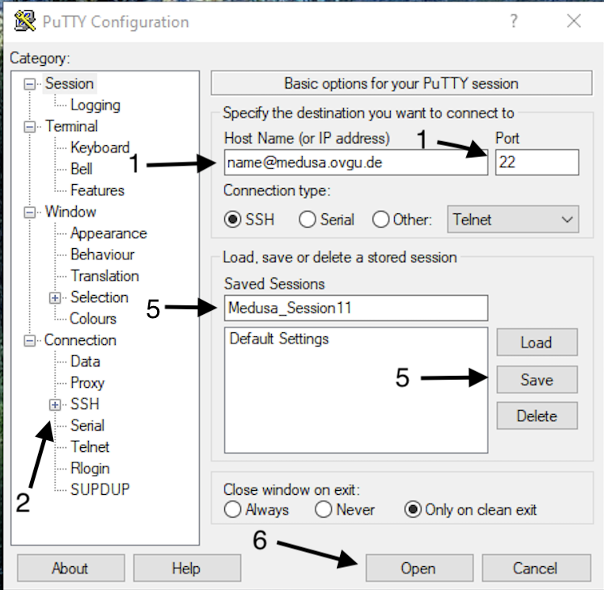
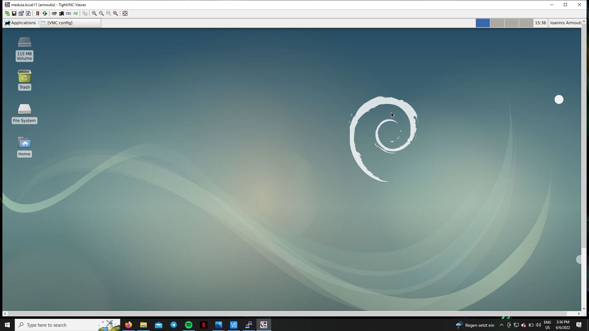

# Accessing Medusa

!!! note "Accessing Medusa outside the OvGU network"
    To access Medusa outside the OvGU network, you need do it via the OvGU [VPN](https://en.wikipedia.org/wiki/Virtual_private_network), please follow the URZ instructions in [here](https://www.urz.ovgu.de/en/vpn-path-204,616.html)


=== "Linux/macOS"

    ## Accessing Medusa from linux/macOS

    Open a terminal in your machine, then type the following command making sure to insert your correct username

    ```bash
    ssh <username>@medusa.ovgu.de
    ```

    If you would like to use any software with a Graphical User Interface (GUI) in Medusa (e.g. Matlab), please use the following command. Keep in mind that this usage mode is very sensitive to latency, thus outside the OvGU network you will likely experience a poor performance in softwares with GUI.

    ```bash
    ssh -X <username>@medusa.ovgu.de
    ```

=== "Windows"

    ## Accessing Medusa from Windows

    #### SSH option
    Windows 10 and 11 include now a built-in SSH client, to use it you can simply start a command prompt, type the following command and enter your password:

    ```
    ssh <username>@medusa.ovgu.de
    ```

    For further information about the SSH client, please take a look at the [official page](https://learn.microsoft.com/en-us/windows/terminal/tutorials/ssh) 

    If you would like to use any software with a Graphical User Interface (GUI) in Medusa (e.g. Matlab), please use the following command. Keep in mind that this usage mode is very sensitive to latency, thus outside the OvGU network you will likely experience a poor performance in softwares with GUI.

    ```bash
    ssh -X <username>@medusa.ovgu.de
    ```

    #### Windows Subsystem for Linux (WSL) option

    Starting from Windows 10 (version 2004), you can easily install in your Windows operating system a subsystem that let you run a distribution of Linux (Ubuntu as default, but you can also choose a different one).</b>  
    WSL installation is very straightforward, you can find all the necessary information in the official [microsoft page](https://learn.microsoft.com/en-us/windows/wsl/install)

    Once you have installed the WSL on your pc, you can easily access Medusa via SSH as we explained above.

    Using a WSL provides many advantages: it allows you to use a Linux environment like Medusa, without giving up your Windows operating system. Interacting with Medusa via WSL facilitates many procedures, such as file transferring from and to Medusa. Files transferred via WSL will be directly available to your Windows system. Furthermore working with the command line will surely speed up all your processes, given that you will not need to go through additional tools to interact with Medusa.

## Avoid passwords use SSH keys

A more secure way to access Medusa is by using so called public key authentication instead of a canonical password.
In a nutshell, a criptographic algorithm creates for you a pair of keys: a **private key** and a **public key**, both of them will be stored in your machine. The private key must always be protected and not shared, while you will share the public key with the cluster administrator. See below how to set-up a pair of private/public keys.


=== "Linux/macOS"

    - Type the following command in your terminal. The keys will be generated inside a hidden `.ssh` folder in a directory of your choice. You will then be asked to provide a **passphrase** for further protection of your private key. We strongly recommend you to set up a passphrase for extra security. 

    ```bash
    $ ssh-keygen -t ed25519
    ```

    - Check that your keys have been generated by typing within the directory that contains the `.ssh` folder: 

    ```
    $ ls -l 
    ```
    You should see a similar output listing both the private key `id_ed25519` and the public key `id_ed25519.pub`
    ```
    -rw------- 1 user  464 Jun 12 17:14 id_ed25519
    -rw-r--r-- 1 user  101 Jun 12 17:14 id_ed25519.pub
    ```

    - Now that you have the key pair, you just need to provide the public key, `id_ed25519` in this case, to your cluster administrator.

    - You can now simply type the following command to access the cluster. The first time you access the cluster, you will be asked to provide the passphrase one time only.

    ```bash
    $ ssh <username>@medusa.ovgu.de
    ```

=== "Windows"

    !!! note "Access with WSL"
        In case you use a WSL on your Windows system, you can directly refer to the Linux/Mac section


    If you want to set up a public key authentication through a GUI, you can use [PUTTY](https://www.putty.org/), a straightforward explanation can be found in the [official microsoft page](https://learn.microsoft.com/en-us/viva/glint/setup/sftp-ssh-key-gen)


## Accessing Medusa via VNC

VNC is for users who prefer a more familiar desktop experience or need to use graphical programs while off-campus. VNC is a multi-step process and not as easy as straight SSH.

First, SSH into Medusa (explained above). Then setup your VNC password. You only need to do this once. The password is stored unencrypted in a text file, so do not use a valuable password (such as for Medusa, email, etc).

```bash
<user>@medusa:~$ vncpasswd
Password:
Verify:
```
Next, start the VNC server.

```bash
<username>@medusa:~$ vncserver
```
New `medusa:9 (me)` desktop is `medusa:9`

Starting applications specified in `/home/username/.vnc/xstartup`
Log file is `/home/username/.vnc/medusa:9.log`

Note the number 9 in `medusa:9`. Yours will likely be different. Take note of your number, as it references your VNC session and will be used later.

The VNC server runs until it is terminated by you (or a reboot of Medusa). If you close your client/disconnect, it will continue to run. If you "log out" in the session, it will terminate the server.

=== "Linux"

    Open a terminal and run the following:

    ```
    vncviewer -via medusa.ovgu.de :9
    ```
    Note the :9. Make sure that this is your number from above. This command will first ask that you authenticate to Medusa, and then it will ask for the VNC password you set before.

=== "macOS"

    macOS has a VNC client built-in, but it isn't SSH aware. So a SSH tunnel needs to be setup first.

    ```bash
    ssh -f -L 5909:127.0.0.1:5909 username@medusa.ovgu.de sleep 60
    ```

    Then you can use VNC.
    ```
    open vnc://127.0.0.1:5909
    ```
    Note the number `5909` in both commands. It should be 5900 + the number noted above. Make sure that it is your number.

=== "Windows"

    Windows lacks a built-in VNC viewer, so you will need to download and install one of your choice, here VNC viewer is used. To be able to establish a ssh tunnel PuTTY is used in addition.

    1. Connect to medusa and start the VNC Server (after setting up your password) to get your session number.
    2. Open putty and specify Host Name as your medusa login (`<user>@medusa.ovgu.de`) and `Port 22`
    3. On the right hand side, click on the + next to SSH and then click Tunnels.
    4. Type 59 (session number) for Source port (e.g. if your session number is 11 type 5911).
    5. Type `localhost:5900` + your unique session number (here 11) as Destination then click Add. (e.g. `localhost:5911`)
    6. Go back to Session. If you don't want to repeat this steps each time you connect to medusa, save this session.
    7. Load and open the session to connect to medusa.
    8. Open a VNC Viewer, type `localhost:59` (session number) and connect.
    9. You will be required to enter your VNC password. Afterwards you will have access to the GUI.

    Note the port number: `5911`. It should be 5900 + the number we noted above. Make sure that it is your number.

    **Putty**
 
    <figure markdown="span">
        { width="500" }
        <figcaption></figcaption>
    </figure>

 
    <figure markdown="span">
        { width="500" }
        <figcaption></figcaption>
    </figure>

    **VNC viewer**

    <figure markdown="span">
        { width="500" }
        <figcaption></figcaption>
    </figure>

    **Finally you have a VNC connection** 

    <figure markdown="span">
        { width="500" }
        <figcaption></figcaption>
    </figure>